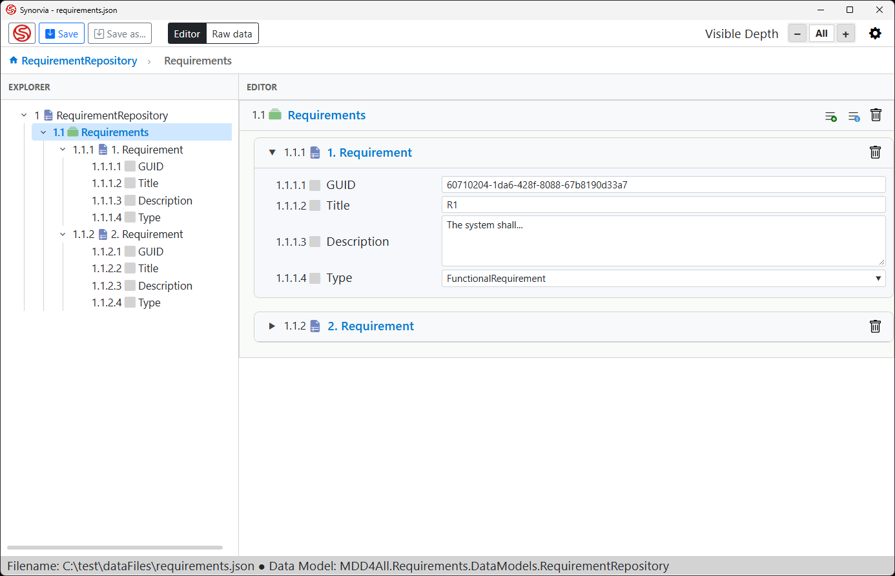

# Synorvia Editor

The **Synorvia Editor** is a generic data editor for data specified by .NET data models, that builds its user interface dynamically from a data model, using .NET Reflection. You don't write any UI code: point the editor at an assembly containing your model classes and it generates the editing interface for you.

## How it works

1. **Provide a DLL** containing your data model classes.
2. **Select the root class** when opening the data model. This is the type that represents the top level of your document.
3. **Edit your data.** The editor inspects the root class via reflection and builds the matching UI automatically.

## Supported data model structure

The editor works with plain data models consisting of properties. Supported property types include:

- **Primitive types** (e.g. `string`, `int`, `double`, `bool`, `DateTime`)
- **Complex object types** (nested classes)
- **Lists** (`List<T>`)
- **Arrays** (`T[]`)
- **Dictionaries** (`Dictionary<TKey, TValue>`)

These types can be combined and nested freely.

## Designed for serialization

Data models are expected to consist of properties only and typically contain no methods. This keeps them simple, and means they can be serialized directly to and from:

- **JSON**
- **XML**

## Key features

- Automatic UI generation from any compatible .NET assembly
- No UI code or editor-specific attributes required in your models
- Works with nested and collection-based data structures
- Round-trip editing with JSON and XML

## License

This project is licensed under the [MIT License](https://opensource.org/licenses/MIT).
